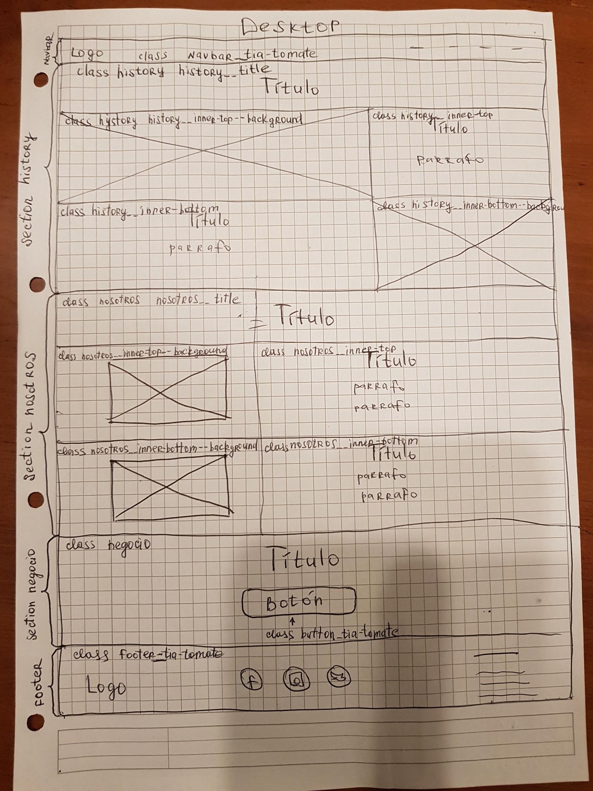
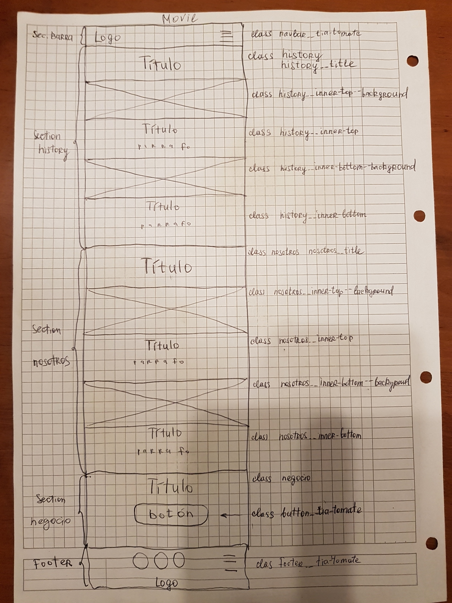

# Requesitos generales:

  - Una barra de navegación y un footer.
  - 3 secciones:
      - La primera, es la sección History(histori de empresa)
      - La segunda seccion, Nosotros(quien trabaja en empresa)
      - La tercera sección Negocio(invita a comprar)

      
    ### Requerimientos específicos:
       - Iconos de redes sociales: 
        *Usar repositorio "Font Awesome"*       
       - Párrafos en general: 
       *Usar lorem ipsum en lugares sin contenido fijo*
      - Secciónes con grilla:
        *Usar Bootstrap*
        
        
    ### Requerimientos visuales:
      - Layout:
     	 - Para crear layout usar Bootstrap.
     - Fuentes *(Buscar en Google Fonts)*:
       - OpenSans-Regular (para párrafos)
       - Raleway-Bold (Títulos)
       - Raleway-ExtraLight (1 Titulo: De nuestro cariño)
     - Colores:
       - Jelly Bean #E56353 (seccion History class history__title(background-color) )
       - Granite Gray #686963 (seccion footer(background-color), section footer class button__tia-tomate(color de font), section nosotros class nosotros__inner-top y nosotros__inner-bottom(color de fonts titulos y parrafos), section history class history__inner-bottom(color de fonts titulo y parrafo), section barra de navegacion class navbar__tia-tomate (color de font de inners) )
       - Nickel #707070(section history class history__inner-top(background-color))
       - Snow #FAFAFA(section history class history__inner-top(color de font titulo y parrafo), section nosotros class nosotros__inner-top--background y nosotros__inner-bottom--background(background-color))
       - White #FFFFFF (section barra de navegacion(background-color), section history class history__title(color de font de titulo) class history__inner-bottom(background-color),section nosotros class nosotros__title(color de font de título), section negocio class negocio(color de font título) classbutton__tia-tomate(background-color) )
      
     - Imagenes (se encuentran en carperta Assets/img)

     
    #sketch (foto aquí: movil y desktop):
    [sketch-Desktop](Assets/img/sketch-desktop.jpg)
    
    
    
    [sketch-movil](Assets/img/sketch-movil.jpg)
    
    
    
    #Una descripción de las secciones, layout, estructura HTML y clases CSS:
   
    
    - barra de navegacion
        - class navbar__tia-tomate
        
       
    - section history:
        - class history
        - class history__title 
        - class history__inner-top--background
        - class history__inner-top
        - class history__inner-bottom--background
        - class history__inner-bottom
    - section nosotros:
        - class nosotros
        - class nosotros__title
        - nosotros__inner-top
        - nosotros__inner-top--background
        - nosotros__inner-bottom
        - nosotros__inner-bottom--background
    - section negocio
        - class negocio
        - class button__tia-tomate 
    - footer
       - class footer__tia-tomate
       
    
     
     
    #estructura de directorio:
     
    ###proyecto(desafio-009):
    
    
     
     
    

          
   
    
     
     
    